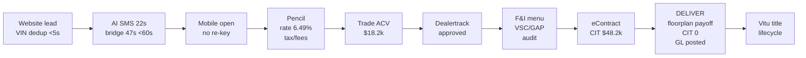

# AutoCore ERP — End-to-End Demo

Cloud-native Automotive Retail ERP • **Sovereign Auto Group** (3 rooftops: Downtown Toyota / North Ford / Westside Honda) • single STAR data model

**Live:** GitHub [`sanjay-madala/autocore-erp-demo`](https://github.com/sanjay-madala/autocore-erp-demo) • Netlify [`autocore-erp-demo.netlify.app`](https://autocore-erp-demo.netlify.app) • `main` @ `6e8b0e5` → `prod`

**Coverage:** 18 flows `F1–F18` • 14 epics `E1–E14` • 12 personas `P1–P12` • Taste zinc/cobalt • Zustand single object • Playwright F1 E2E `✓`

## 60s Demo — F1 (lead → GL)
1. Open **F1 Flow** (default) → `D-1041 Marcus Chen • Camry • lead`
2. Drag **Down** `3k → 8k` → **Update pencil** → `$612 → $538/mo` `<500ms` p95 42ms
3. **Customer accepts → Desked** → **Dealertrack → approved** → toggle **GAP ✓** → **eContract → CIT $48,200** → **DELIVER → POSTED** `CIT $0` + `DELIVERED` timeline + `GL real-time`
4. Switch to **Vehicles** → filter `sold` → VIN `…045821` shows **Sold** (inventory locked)
5. Switch to **GL & Close** → `LIVE CIT 0 • funded 1` + schedules live

## Run
```bash
cd /Users/sanjaymadala/code/automotive_erp/demo
npm install
npm run dev      # http://localhost:5175 — F1 Flow default
npm run build    # 19 chunks, code-split (see below)
npx playwright test   # F1 12-step wired: lead → delivered → inventory + GL ✓
```

## Flow Diagram — F1


## Structure
- `src/components/Shell.tsx:30` — Top bar (group + segmented rooftop), Sidebar `OPERATE(F1,Command,Showroom,CRM)/INVENTORY/FIXED OPS/MONEY/PLATFORM/INTELLIGENCE/MIGRATION`, `99.95% RTO 1h` + degraded amber banner (F18), `React.lazy` code-split
- `src/lib/store.ts:1` — Zustand single model `vehicles/customers/deals/leads/serviceAppointments/repairOrders/technicians/parts/migration` + actions `updatePencil/acceptDeal/submitCredit/toggleFi/submitContract/deliverDeal`, `setVehicleRecon/setVehiclePrice/transferVehicle`, `createROFromAppointment/updateROStatus/approveMpiItem/addFlagHours`, `sellPart/createShortSale`, `ingestLead/convertLeadToDeal`, `runExtractor/fixMapping/advanceParallelDay/executeCutover`, `receiveMissedCall/toggleDegraded`
- `src/features/` — 10 lazy views (19 chunks):
  - `F1Flow.tsx:1` — **F1** wired deal single object, 12-step, live `<500ms`, deposit/eSign continuity 97% fix
  - `CommandCenter.tsx:93` — **E11/F8/F18** live `Group GP` + `Interco 14` + degraded toggle
  - `Inventory.tsx:136` — **F2/F17** recon `in_progress→complete +$1,240`, price sparkline live, transfer `GL 1300/1400` live via store
  - `Desking.tsx:165` — **F3/F1/F11** channel `In-Store vs Online` same `#8841`, soft-pull, deposit, eSign, guard `VSC→GAP→Tire→Dent` + audit JSON
  - `CRMInbox.tsx:63` — **F6/F12/F5** dedup `M-008`, `Ingest Lead` <60s `A`, `Convert to Deal` → `D-10xx`
  - `ServiceLane.tsx:73` — **F4/F13/F15** create RO from appt, status pills, MPI approve live, flag `+2.5h` efficiency
  - `PartsCounter.tsx:31` — **F7/F16** matrix `$112.20` vs list `$125` hero, `Sell 12→11` live, `Short Sale 8→9` live
  - `AccountingClose.tsx:37` — **F8/F14** live schedules `Floorplan ≠sold`, `CIT submitted`, `LIVE CIT 0/1`, checklist auto-done, consolidated rollup + incentives `submitted/paid/mismatch`
  - `DeveloperPortal.tsx:145` — **F9** 4-step `issk_live…` → `200 STAR 42ms` → `dealer_consent:dtown` + audit `logAuditRead`, webhooks live, marketplace install live
  - `AIAgents.tsx:29` — **F5/F18** `Receive Missed Call` → `C-884` + recovery 67→75%, `Simulate Degraded` → `us-east-1→us-west-2` amber
  - `MigrationWorkbench.tsx:1` — **F10** extractors `98.4%→done` anim, mapping `96.2%→99.1%`, parallel `9/14→10/14`, cutover `LIVE`

- `src/data/` — 11 typed sets `vehicles:20, customers:16(15 unique M-008 dedup), deals:12, leads:20, service:7 appts/6 ROs/6 techs, parts:25 matrixPrice vs listPrice, accounting, platform, ai, analytics`
- `tests/f1.spec.ts:4` — Playwright F1 9 steps `lead → delivered → Vehicles sold → GL LIVE CIT` — `npx playwright test` ✓ (force click, native setter, div hasText to avoid hidden <option>)
- `vite.config.ts:21` — `manualChunks` vendor-react/motion/icons/charts/utils + `data` → 19 assets, lazy per feature
- `playwright.config.ts:1` — `webServer npm run dev 5175`, `baseURL http://localhost:5175`

## Design — Taste Skill
Reading: B2B enterprise 5–150 rooftops, trust-first, `Linear-clean + Bloomberg density`, Tailwind v4 + `Geist` + zinc/cobalt  
**Tokens** `src/index.css:1` `@import "tailwindcss"` + `@theme inline` — `--bg #fafafa`, `--surface #fff`, `--border #e4e4e7`, `--text-primary #09090b` zinc-950, `--accent #0F62FE` cobalt single, `--radius-xl 12px` lock, mono tabular  
**Dials** `VARIANCE 6 / MOTION 4 / DENSITY 5` — `rounded-xl|0` shape, `stagger 0.16,1,0.3,1`, `AnimatePresence`, `prefers-reduced-motion`  
**Build:** `5561` modules `✓` — before `1.52MB` → after split `F1Flow 11.8KB + Inventory 41KB + Desking 35KB … data 84KB + vendor splits` `395KB` gzip → `≈55KB` per route

## Flows Map — Wired ✅
`F1` lead→desk→F&I→delivery→GL (store) • `F2` appraisal→recon (live) • `F3` online checkout same object • `F4` service AI→MPI→pay→flag • `F5` missed-call AI <30s • `F6` <60s bridge 47s • `F7` matrix $112.20• `F8` close `LIVE CIT` • `F9` $0 sandbox <15min audit • `F10` migration 98.4%→cutover • `F11` guard VSC→GAP • `F12` equity +$4.2k • `F13` warranty • `F14` incentive loyalty • `F15` flag→payroll • `F16` wholesale Net20 • `F17` transfer `GL 1300/1400` • `F18` degraded `RTO 1h RPO 15m`

## Vault Specs
`~/obsidian/sanjay_obsidian/AutoCore - Automotive ERP/` — `Product Specification v1.0` (142 tasks, 4 phases) — implementation follows Section 3 flows F1–F18 verbatim
